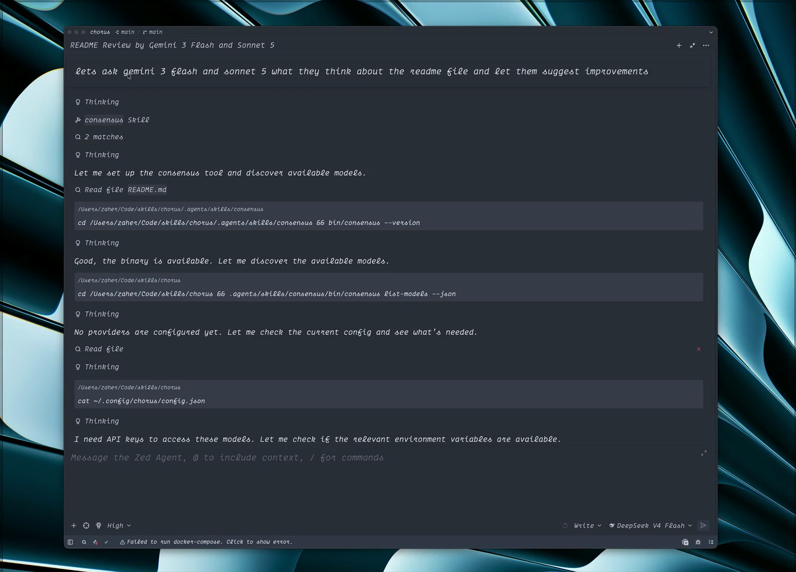

# Chorus

> [!IMPORTANT]
> This project is under heavy active development. Expect frequent breaking changes, new features, and reworked internals. Lock to a specific version if you depend on it in production.

Chorus is a collection of AI Agent Skills hosted in a single repository. It ships with a supporting CLI that acts as a broker between a coding agent and multiple model providers, enabling multi-model consensus.

The CLI queries multiple AI model providers in parallel and returns raw responses, allowing your coding agent to compare, combine, and synthesize a final recommendation. This reduces model-specific bias and single-model blind spots.

[](./assets/Chorus.mp4)

## Prerequisites

- **Node.js 18+** or **Bun 1.3.14+** (required for source builds)
- **npx** (ships with Node.js, needed for the skills CLI install path)
- **macOS or Linux** (Windows support is not yet tested)
- At least one API key from a supported provider

## Quick Start

After installation, open your code agent and prompt it something like:

```text
Let's ask gpt-4o and claude-sonnet-4 to help me decide if I should use PostgreSQL or SQLite for a single-user desktop app.
```

The CLI returns raw model responses, which your coding agent processes to produce a synthesized recommendation.

## Comparison: Chorus Consensus vs OpenRouter Fusion

| Aspect | Chorus Consensus | OpenRouter Fusion |
|--------|------------------|-------------------|
| **Invocation** | Agent shells out to CLI from natural language ("ask gpt-4o and claude...") | Must be configured in the API request; model calls the tool or is forced via `tool_choice: "required"` |
| **Model selection** | Arbitrary list per request (`--models a,b,c`) | Arbitrary list per request (`analysis_models`: 1–8 models) |
| **Deliberation** | All models answer in parallel → Agent synthesizes the final answer | Panel answers in parallel → Judge compares (structured JSON: consensus, contradictions, coverage gaps, unique insights, blind spots) → Outer model writes final answer |
| **Synthesis** | Done by *your agent* (or another model if you want to) with full context | Judge compares panel responses; outer model synthesizes the final answer from the judge's analysis |
| **Control** | Deterministic fan-out every call | Model decides when to invoke (unless `tool_choice: "required"`) |
| **Output** | JSON array of raw model responses + metadata | One final message from the outer model (judge's structured analysis is internal) |
| **Cost model** | N× single call (N = models you requested) | ~4–5× single call (3 panel + 1 judge + outer model) |
| **Use case** | "Show me what each model thinks so I can synthesize" | "Let the models deliberate and give me the best answer" |
| **Transparency** | Full: every model's complete response is visible | Opaque: you see the final answer, not panel raw outputs |
| **Web search / fetch** | Not built in (agent could add separately) | Panel models and judge each have `openrouter:web_search` and `openrouter:web_fetch` enabled |
| **Recursion protection** | N/A (one-shot fan-out) | `x-openrouter-fusion-depth` header prevents recursive invocation |
| **Presets** | N/A | `openrouter/fusion-flash` pre-tunes panel for low-latency agentic turns |
| **Temperature** | Same temperature for all models | Panel runs at configurable temperature; judge always runs at temperature 0 |

Chorus is a transparent fan-out broker: you see every model's raw response. Fusion is an opinionated deliberation pipeline that adds a structured comparison step and lets the outer model synthesize, at the cost of opacity into panel outputs.

## Install

### Via the skills CLI (recommended for agents)

Add the agent skills from this repo with Vercel's `skills` CLI:

```bash
npx --yes skills add zaherg/chorus
```

> [!NOTE]
> On first use, the skill downloads the platform-specific binary from the GitHub release. The install script handles architecture detection automatically.

If the auto-download fails (e.g., in restricted environments), run the skill-local installer from the installed skill folder:

```bash
.agents/skills/consensus/scripts/install.sh
```

The installer downloads the binary into `bin/consensus` under the current skill directory. Use `scripts/install.sh --prefix DIR` to install to `DIR/consensus`, or `scripts/install.sh --no-verify` only when checksum verification must be skipped explicitly.

### From source (for contributors)

```bash
git clone https://github.com/zaherg/chorus.git && cd chorus
bun install
bun run build:binary
```

The compiled binary is placed in the `dist` directory.

### Standalone use

This CLI is designed for agent orchestration. If you want to use it directly, read the bundled skill files for usage details:

- [`skills/consensus/SKILL.md`](./skills/consensus/SKILL.md)
- [`skills/delegate/SKILL.md`](./skills/delegate/SKILL.md)

## Configuration

The CLI stores its configuration at `~/.config/chorus/config.json`. The file is created automatically on first run with empty defaults, so you only need to edit it to add credentials and preferences.

Minimum viable configuration:

```json
{
  "openai_api_key": "$OPENAI_API_KEY",
  "anthropic_api_key": "$ANTHROPIC_API_KEY",
  "log_level": "info"
}
```

Key values can be a literal string or an `$ENV_VAR` reference. At least one configured provider key is required to run a consensus.

Optional settings:

| Setting | Default | Description |
|---|---|---|
| `cli_timeout_ms` | 30000 | Timeout for the entire CLI invocation |
| `provider_timeout_ms` | 120000 | Timeout per individual provider request |
| `log_level` | "info" | One of: "debug", "info", "warn", "error" |
| `max_concurrent_processes` | 3 | Maximum parallel provider requests |
| `allow_insecure_custom` | false | Allow HTTP (not HTTPS) custom API URLs |

## Exit Codes

| Code | Meaning |
|---|---|
| 0 | Success (at least one participant response collected) |
| 1 | Broker error (config load, all participants failed, or unrecoverable catalog error) |
| 2 | Argument parse error or invalid stdin JSON |
| 3 | Model resolution error (ambiguous or unknown `route_id`, or no providers configured) |

## Agent Skills

The skills follow the [Agent Skills specification](https://agentskills.io/specification). Two skills are bundled:

### consensus

[`skills/consensus/`](./skills/consensus/SKILL.md) runs multi-model independent evaluation of a prompt, file set, decision, or proposal. It fans out across selected models in parallel and brokers the raw model responses back to you. You combine them in the agent rather than relying on CLI-side synthesis.

### delegate

[`skills/delegate/`](./skills/delegate/SKILL.md) shells out to local CLI coding agents for focused subtasks or parallel independent work. It targets locally installed agents only: Claude Code, Codex, OpenCode, and GitHub Copilot. If an agent is not installed on the machine, delegate does not run it.

## Development

Useful commands:

```bash
bun test
bun run build
bunx tsc -p tsconfig.json --noEmit
bun run src/cli.ts --help
bun run src/cli.ts list-models --json
bun run src/cli.ts --schema
```

The local test suite uses fake keys and dependency injection; no live provider
API keys are required.

The repo currently uses:

- Bun for runtime and package management
- TypeScript with ES modules
- Zod v4 for validation
- Biome for linting and formatting

The CLI reads its version from `package.json` at build time.

## Troubleshooting

| Symptom | Likely cause |
|---|---|
| Exit code 1 | Config load failure, catalog unavailable, or all providers failed |
| Exit code 3 | No providers configured or `route_id` is ambiguous |
| Provider timeouts | Increase `provider_timeout_ms` in config |
| "No API key configured" | Add the required key to `~/.config/chorus/config.json` |
| Binary not found | Run `scripts/install.sh` from the skill directory |

## License

[MIT](./LICENSE)

## Disclaimer

Chorus orchestrates requests to third-party AI providers. Model output can be incomplete, outdated, or incorrect. Review important decisions and code changes before relying on them.

Provider APIs, model availability, pricing, and terms can change independently of this package. Keep credentials private and follow each provider's usage policies.
