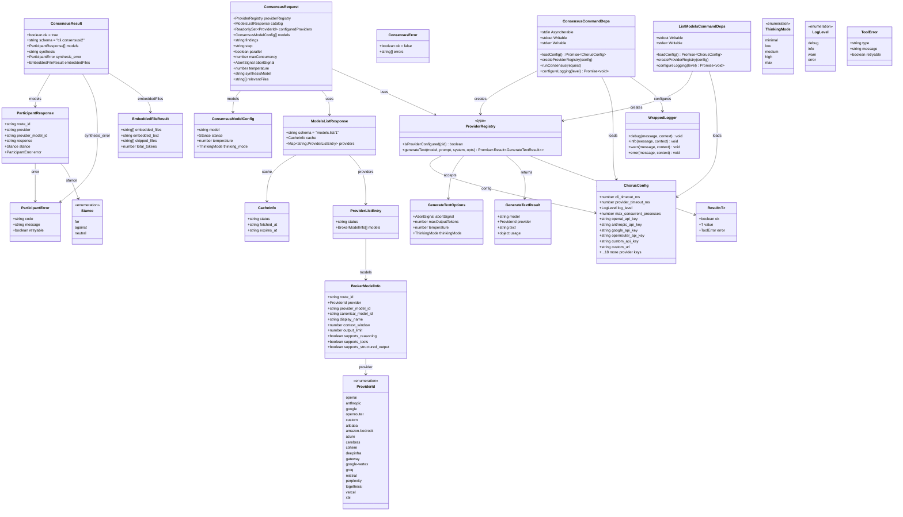
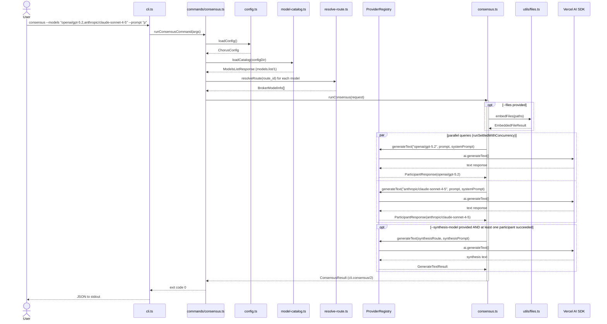
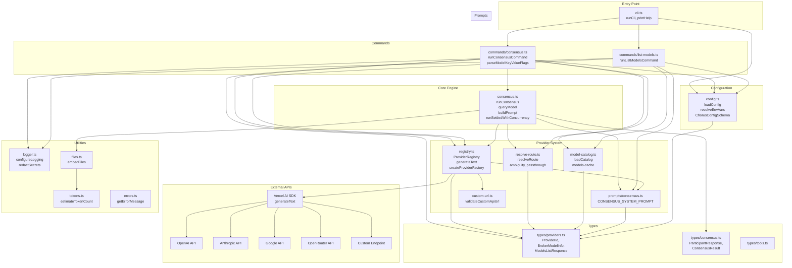

# UML Class Diagram

Core types, interfaces, and their relationships in `@zaherg/chorus`.

```mermaid
classDiagram
    direction TB

    class ConsensusRequest {
        +ProviderRegistry providerRegistry
        +ModelsListResponse catalog
        +ReadonlySet~ProviderId~ configuredProviders
        +ConsensusModelConfig[] models
        +string findings
        +string step
        +boolean parallel
        +number maxConcurrency
        +AbortSignal abortSignal
        +number temperature
        +string synthesisModel
        +string[] relevantFiles
    }

    class ConsensusResult {
        +boolean ok = true
        +string schema = "cli.consensus/2"
        +ParticipantResponse[] models
        +string synthesis
        +ParticipantError synthesis_error
        +EmbeddedFileResult embeddedFiles
    }

    class ConsensusError {
        +boolean ok = false
        +string[] errors
    }

    class ConsensusModelConfig {
        +string model
        +Stance stance
        +number temperature
        +ThinkingMode thinking_mode
    }

    class ParticipantResponse {
        +string route_id
        +string provider
        +string provider_model_id
        +string response
        +Stance stance
        +ParticipantError error
    }

    class ParticipantError {
        +string code
        +string message
        +boolean retryable
    }

    class EmbeddedFileResult {
        +string[] embedded_files
        +string embedded_text
        +string[] skipped_files
        +number total_tokens
    }

    class ProviderRegistry {
        <<type>>
        +isProviderConfigured(pid) boolean
        +generateText(model, prompt, system, opts) Promise~Result~GenerateTextResult~~
    }

    class ModelsListResponse {
        +string schema = "models.list/1"
        +CacheInfo cache
        +Map~string,ProviderListEntry~ providers
    }

    class ProviderListEntry {
        +string status
        +BrokerModelInfo[] models
    }

    class CacheInfo {
        +string status
        +string fetched_at
        +string expires_at
    }

    class BrokerModelInfo {
        +string route_id
        +ProviderId provider
        +string provider_model_id
        +string canonical_model_id
        +string display_name
        +number context_window
        +number output_limit
        +boolean supports_reasoning
        +boolean supports_tools
        +boolean supports_structured_output
    }

    class ChorusConfig {
        +number cli_timeout_ms
        +number provider_timeout_ms
        +LogLevel log_level
        +number max_concurrent_processes
        +string openai_api_key
        +string anthropic_api_key
        +string google_api_key
        +string openrouter_api_key
        +string custom_api_key
        +string custom_url
        +...18 more provider keys
    }


    class GenerateTextOptions {
        +AbortSignal abortSignal
        +number maxOutputTokens
        +number temperature
        +ThinkingMode thinkingMode
    }

    class GenerateTextResult {
        +string model
        +ProviderId provider
        +string text
        +object usage
    }

    class WrappedLogger {
        +debug(message, context) void
        +info(message, context) void
        +warn(message, context) void
        +error(message, context) void
    }

    class ConsensusCommandDeps {
        +loadConfig() Promise~ChorusConfig~
        +createProviderRegistry(config)
        +runConsensus(request)
        +configureLogging(level) Promise~void~
        +stdin AsyncIterable
        +stdout Writable
        +stderr Writable
    }

    class ListModelsCommandDeps {
        +loadConfig() Promise~ChorusConfig~
        +createProviderRegistry(config)
        +configureLogging(level) Promise~void~
        +stdout Writable
        +stderr Writable
    }

    class ProviderId {
        <<enumeration>>
        openai
        anthropic
        google
        openrouter
        custom
        alibaba
        amazon-bedrock
        azure
        cerebras
        cohere
        deepinfra
        gateway
        google-vertex
        groq
        mistral
        perplexity
        togetherai
        vercel
        xai
    }

    class Stance {
        <<enumeration>>
        for
        against
        neutral
    }

    class ThinkingMode {
        <<enumeration>>
        minimal
        low
        medium
        high
        max
    }

    class LogLevel {
        <<enumeration>>
        debug
        info
        warn
        error
    }

    class Result~T~ {
        +boolean ok
        +T value
        +ToolError error
    }

    class ToolError {
        +string type
        +string message
        +boolean retryable
    }

    ConsensusRequest --> ConsensusModelConfig : models
    ConsensusRequest --> ModelsListResponse : uses
    ConsensusRequest --> ProviderRegistry : uses
    ConsensusResult --> ParticipantResponse : models
    ConsensusResult --> ParticipantError : synthesis_error
    ConsensusResult --> EmbeddedFileResult : embeddedFiles
    ParticipantResponse --> ParticipantError : error
    ParticipantResponse --> Stance : stance

    ModelsListResponse --> CacheInfo : cache
    ModelsListResponse --> ProviderListEntry : providers
    ProviderListEntry --> BrokerModelInfo : models
    BrokerModelInfo --> ProviderId : provider

    ProviderRegistry --> ChorusConfig : config
    ProviderRegistry --> GenerateTextOptions : accepts
    ProviderRegistry --> GenerateTextResult : returns
    ProviderRegistry --> Result~GenerateTextResult~ : generateText return

    ConsensusCommandDeps --> ProviderRegistry : creates
    ConsensusCommandDeps --> ChorusConfig : loads
    ConsensusCommandDeps --> WrappedLogger : configures

    ListModelsCommandDeps --> ProviderRegistry : creates
    ListModelsCommandDeps --> ChorusConfig : loads
```

## Sequence Diagram: Consensus Run (parallel mode)

```mermaid
sequenceDiagram
    actor User
    participant CLI as cli.ts
    participant Cmd as commands/consensus.ts
    participant Config as config.ts
    participant Catalog as model-catalog.ts
    participant Resolve as resolve-route.ts
    participant Reg as ProviderRegistry
    participant Engine as consensus.ts
    participant Files as utils/files.ts
    participant AI as Vercel AI SDK

    User->>CLI: consensus --models "openai/gpt-5.2,anthropic/claude-sonnet-4-5" --prompt "p"
    CLI->>Cmd: runConsensusCommand(args)
    Cmd->>Config: loadConfig()
    Config-->>Cmd: ChorusConfig
    Cmd->>Catalog: loadCatalog(configDir)
    Catalog-->>Cmd: ModelsListResponse (models.list/1)
    Cmd->>Resolve: resolveRoute(route_id) for each model
    Resolve-->>Cmd: BrokerModelInfo[]

    Cmd->>Engine: runConsensus(request)
    activate Engine

    opt --files provided
        Engine->>Files: embedFiles(paths)
        Files-->>Engine: EmbeddedFileResult
    end

    par parallel queries (runSettledWithConcurrency)
        Engine->>Reg: generateText("openai/gpt-5.2", prompt, systemPrompt)
        Reg->>AI: ai.generateText()
        AI-->>Reg: text response
        Reg-->>Engine: ParticipantResponse(openai/gpt-5.2)
    and
        Engine->>Reg: generateText("anthropic/claude-sonnet-4-5", prompt, systemPrompt)
        Reg->>AI: ai.generateText()
        AI-->>Reg: text response
        Reg-->>Engine: ParticipantResponse(anthropic/claude-sonnet-4-5)
    end

    opt --synthesis-model provided AND at least one participant succeeded
        Engine->>Reg: generateText(synthesisRoute, synthesisPrompt)
        Reg->>AI: ai.generateText()
        AI-->>Reg: synthesis text
        Reg-->>Engine: GenerateTextResult
    end

    Engine-->>Cmd: ConsensusResult (cli.consensus/2)
    deactivate Engine

    Cmd-->>CLI: exit code 0
    CLI-->>User: JSON to stdout
```

## Component Diagram

```mermaid
graph TD
    subgraph "Entry Point"
        CLI[cli.ts<br/>runCli, printHelp]
    end

    subgraph "Commands"
        CC[commands/consensus.ts<br/>runConsensusCommand<br/>parseModelKeyValueFlags]
        LM[commands/list-models.ts<br/>runListModelsCommand]
    end

    subgraph "Core Engine"
        CS[consensus.ts<br/>runConsensus<br/>queryModel<br/>buildPrompt<br/>runSettledWithConcurrency]
    end

    subgraph "Configuration"
        CF[config.ts<br/>loadConfig<br/>resolveEnvVars<br/>ChorusConfigSchema]
    end

    subgraph "Provider System"
        PR[registry.ts<br/>ProviderRegistry<br/>generateText<br/>createProviderFactory]
        MC[model-catalog.ts<br/>loadCatalog<br/>models-cache]
        PM[provider-map.ts<br/>getModelsDevProviderKey]
        RR[resolve-route.ts<br/>resolveRoute<br/>ambiguity, passthrough]
        CU[custom-url.ts<br/>validateCustomApiUrl]
    end

    subgraph "External APIs"
        AI[Vercel AI SDK<br/>generateText]
        P1[OpenAI API]
        P2[Anthropic API]
        P3[Google API]
        P4[OpenRouter API]
        P5[Custom Endpoint]
    end

    subgraph "Utilities"
        LG[logger.ts<br/>configureLogging<br/>redactSecrets]
        FL[files.ts<br/>embedFiles]
        TK[tokens.ts<br/>estimateTokenCount]
        ER[errors.ts<br/>getErrorMessage]
    end

    subgraph "Types"
        TP[types/providers.ts<br/>ProviderId, BrokerModelInfo,<br/>ModelsListResponse]
        TC[types/consensus.ts<br/>ParticipantResponse,<br/>ConsensusResult]
        TT[types/tools.ts]
    end

    subgraph "Prompts"
        PM[prompts/consensus.ts<br/>CONSENSUS_SYSTEM_PROMPT]
    end

    CLI --> CF
    CLI --> CC
    CLI --> LM

    CC --> CF
    CC --> PR
    CC --> CS
    CC --> LG

    LM --> CF
    LM --> PR
    LM --> LG

    CS --> PR
    CS --> RR
    CS --> FL
    CS --> PM

    CC --> MC
    CC --> RR
    LM --> MC
    LM --> PM

    PR --> CU
    PR --> PM
    PR --> AI

    AI --> P1
    AI --> P2
    AI --> P3
    AI --> P4
    AI --> P5

    FL --> TK

    CC --> TP
    PR --> TP
    RR --> TP
    MC --> TP
    PM --> TP
    CS --> TC
    CF --> TP
```
